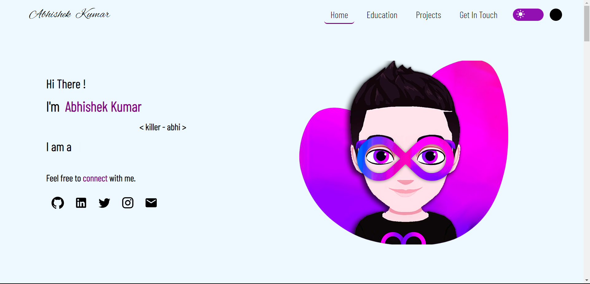
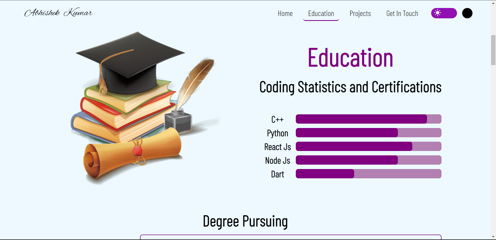
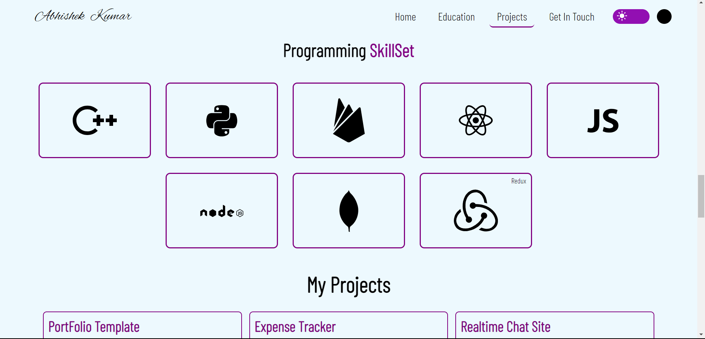
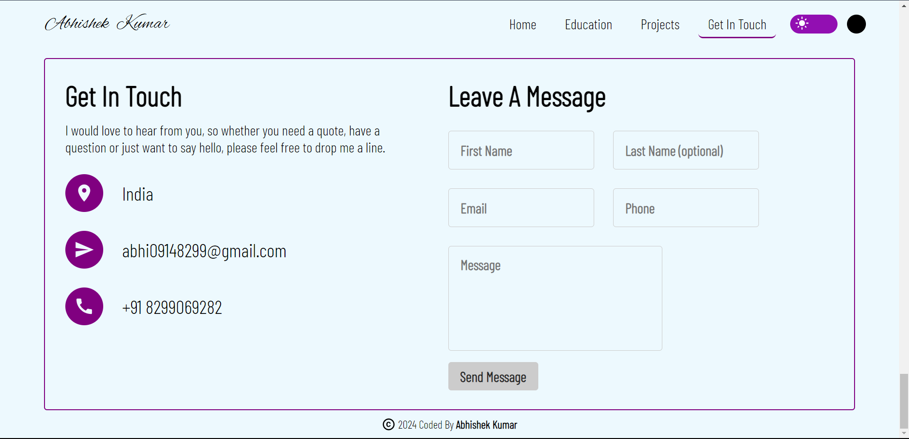

# Vishal Giri's Portfolio

Welcome to my professional portfolio! This repository showcases my skills, projects, and achievements. Feel free to explore the code and projects listed here.

## Screenshots
  
  
  
  
## Table of Contents

- [Home](#home)
- [Education](#education)
- [Professional Skills](#skills)
- [Get In Touch](#getInTouch)

## Contact

Connect with me! Feel free to reach out for collaboration, job opportunities, or just to say hello.

- **Email:** vishalgiri8767@gmail.com
- **LinkedIn:** [https://www.linkedin.com/in/vishalgiri07/](linkedin-link)
- **Portfolio:** [https://github.com/Vishalgiri8767](your-portfolio-link)

Thank you for visiting my portfolio! If you find it interesting, don't forget to ⭐️ the repository.
